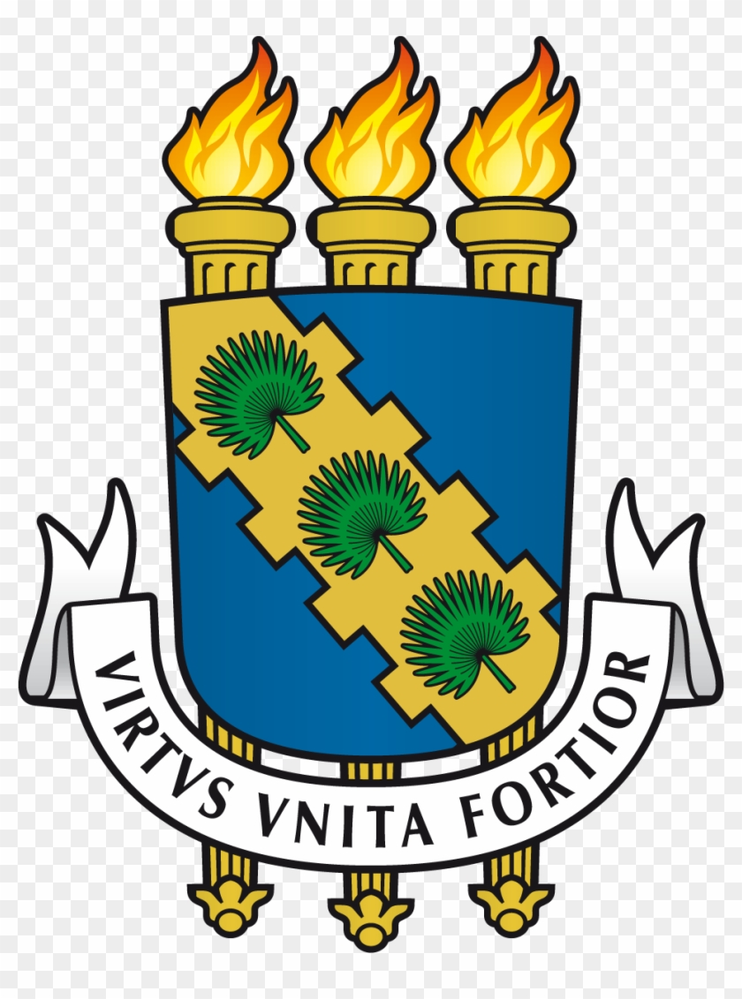
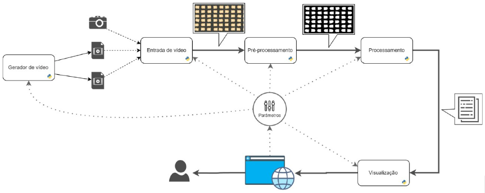
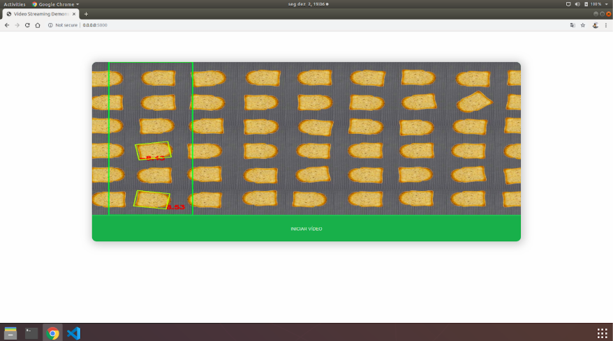
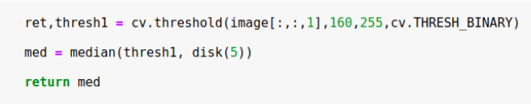
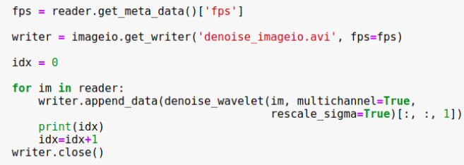
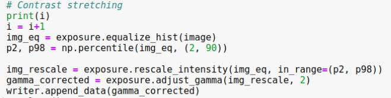

  

  <h2 align="center">Toast Tracker</h2>

  

    TI0147 - FUNDAMENTOS DE PROCESSAMENTO DIGITAL DE IMAGENS
     
    
Universidade Federal do Ceará

    
Departamento de Engenharia de Teleinformática

    
December 11, 2019

  

## Contents
- [1. Introdução](#Introdução)
  - [1.1 Estudo do Problema](#Estudo-do-Problema)
  - [1.2 Pipeline da Aplicação](#Pipeline-da-Aplicação)
- [2. Interface da Aplicação](#Interface-da-Aplicação)
  - [2.1 Front-End: Apresentação Visual da Interface](#Front-End:-Apresentação-Visual-da-Interface)
  - [2.2 Back-End: Processamento Interno da Interface](#Back-End:-Processamento-Interno-da-Interface)
  - [Bibliografia](#Bibliografia)
- [3. Pré-Processamento dos Vídeos](#Pré-Processamento-dos-Vídeos)
  - [3.1 Objetivos ](#Objetivos)
  - [3.2 Metodologia](#Metodologia)
  - [3.3 Técnicas Utilizadas](#Técnicas-utilizadas)
  - [3.4 Algoritmos](#Algoritmos)
  - [3.5 Resultados](#Resultados)
- [4. Processamento dos Vídeos](#Processamento-dos-Vídeos)
- [5. Testes e Resultados](#Testes-e-Resultados)
- [6. Conclusão](#Conclusão)
- [7. Apêndice A - Listagem das Equipes](#Apêndice-A---Listagem-das-Equipes)
- [8. Referências](#copyright-and-license)

## Introdução

O presente documento detalha o desenvolvimento e conclusão do projeto [nome do projeto], que tem como objetivo detectar falhas de padrão no posicionamento de torradas em uma esteira de linha de produção. Esse projeto foi desenvolvido como atividade final da disciplina “TI0147 - Fundamentos de Processamento Digital de Imagens” , ofertada pelo  Departamento de Teleinformática da Universidade Federal do Ceará (UFC-DETi), turma 2019.2, no qual houve participação de toda a turma e gerenciamento do aluno Natanael Moreira de Lemos. No Apêndice A tem uma listagem detalhada de cada cada equipe, com seus participantes e atividades desenvolvidas.

O objetivo geral do projeto consiste em desenvolver uma aplicação computacional capaz de detectar as torradas que estão fora do padrão de enquadramento(?) e as classifica como adequada como adequadas ou inadequadas[ver com o pessoal da interface a classificação], em uma simulação que imita uma situação real de um esteira de linha de produção, dadas as suas dimensões físicas. O sistema deveria[como o sistema deveria se comportar?]. O projeto tem justificativa prática e é de interesse comercial, sistemas como o desenvolvido neste trabalho podem ser utilizados na indústria, no setor de qualidade de uma fábrica para otimização da linha de produção.Tal tecnologia substituiria a prática utilizada atualmente, na qual observadores humanos fazem a inspeção de qualidade, o que torna a possibilidade de erros humanos recorrente.

A implementação final utilizou [listar softwares, linguagens, bibliotecas e etc].

## Estudo do Problema

Here goes all the budgets

## Pipeline da Aplicação

Here goes all the budgets

## Interface da Aplicação

| Tecnologias Utilizadas  |   |   |   |   |
|---|---|---|---|---|
|Linguagem | Python |   |   |   |
| Framework  | Flask |   |   |   |

A aplicação da interface consiste de um servidor de streaming de vídeos feito utilizando o framework Flask.

## Front-End: Apresentação Visual da Interface

Tecnologias do front end:
- Html
- Css
- JS

| Elementos  |   |
|---|---|
|Botão | Inicia a requisição dos frames vindos do backend em flask |
| Player  | Mostra os frames | 

## Back-End: Processamento Interno da Interface

No servidor python é utilizado opencv para abrir o vídeo salvo e transmitir para o arquivo html, sendo um frame de cada vez. Antes de enviar o frame é feito um pós-processamento com os dados recebidos e são aplicados os contornos nas torradas que possuem inclinação maior que o threshold definido.

O servidor de streaming é baseado em threads e eventos, as threads são utilizadas para rodar o processo em paralelo (fazer o streaming), caso contrário precisaríamos processar todo o vídeo e carregar antes de visualizar na página.

Os eventos são : 

|  |   |
|---|---|
| Wait | Espera o próximo frame estar pronto |
| Set  | Sinaliza que o frame está pronto |
| Clear  | Invocado após processar o frame | 

Os eventos wait e clear são invocados pelo cliente e o evento set é invocado pela câmera.

O servidor Flask possui apenas duas rotas:

|  |   |
|---|---|
| Index | Rota que renderiza a página principal |
| VideoFeed  | Rota que recebe os frames do servidor, é utilizada dentro de uma tag   e é atualizada constantemente. |

A Função de geração de streaming de vídeo utiliza a classe câmera do opencv lendo um arquivo pronto, no caso o vídeo original. Esta classe define o alfa que é o limiar de ângulo para que apareça um contorno na torrada. 

O vídeo é capturado de um arquivo de vídeo já existente, mas poderia ser diretamente de uma câmera. Após a captura é aplicada uma função de contorno nas torradas utilizando os frames do vídeo original para formar um novo vídeo. Um retângulo é aplicado definindo os pontos iniciais e finais da torrada e exibido em seguida.

## Bibliografia

O código em si foi encontrado em um tutorial e modificado para nossas necessidades de pós-processamento. O criador do código original é o Miguel Grinberg e o link que ele explica passo-a-passo é esse: 

https://blog.miguelgrinberg.com/post/video-streaming-with-flask

O código é feito utilizando uma câmera do opencv para ler um arquivo pronto, mas poderia facilmente ser modificado para ler direto da webcam ou outro periférico de câmera instalado no computador.

Numa situação de produção poderia ser utilizado Raspberry Pi como câmera, sendo necessárias maiores modificações.

## Pré-Processamento dos Vídeos

## Objetivos

Após a aquisição das imagens é realizada a etapa do pré-processamento. O objetivo da atividade de pré-processamento consiste no realce e correção de degradação das imagens adquiridas, a fim da adequação do produto à utilização na etapa de construção do algoritmo  de processamento. Fundamentalmente, o propósito desta atividade é então subjetivo às necessidades do algoritmo aplicado nas imagens em fases subsequentes do trabalho.

## Metodologia

Com base nos requisitos levantados para as imagens de saída, operou-se nas imagens obtidas com métodos especificados na linguagem python, nominalmente:

- Equalização de histograma
- Ajuste gamma
- Thresholding
- Filtragem

As operações acima foram divididas entre os membros da equipe para a manipulação das imagens adquiridas. Subgrupos foram formados e responsabilizados pela execução de cada procedimento. Para o grupo de ajuste de contraste, foi de atribuição aplicar e investigar possíveis melhorias decorrentes da manipulação das imagens via aplicação de ajuste gamma e equalização de histograma. 

Para a equipe de análise de ruído, foi dada a tarefa de examinar potenciais vantagens em aplicar processos de remoção de ruído às imagens. Finalmente, para a equipe de Thresholding, ficou a responsabilidade de binarizar as imagens e entregar o output da atividade.

## Técnicas utilizadas

A forma como a imagem é manipulada no pré-processamento é específica para cada aplicação, pois as técnicas utilizadas são orientadas pelo escopo do projeto. A partir de uma análise visual das imagens que foram geradas e dos requisitos levantados para o projeto foram decididos realces à serem realizados.

- Inicialmente é feito a transformação da imagem para tons de cinza com o objetivo de facilitar o processamento e torná-lo mais veloz.

- A equalização de histograma tem o objetivo de melhorar o contraste da imagem, é reduzida as diferenças de intensidade entre os elementos da imagem e os detalhes são realçados. Para isso, os valores de intensidade da imagem são redistribuídos para que se possua um histograma uniforme.

- Ajuste de gamma é uma transformação de potência onde é buscado o ajuste quanto ao brilho. Em imagens muito esbranquiçadas ou muito escuras o ajuste de gamma realça detalhes que anteriormente não estavam visíveis.

- A limiarização ou thresholding tem como resultado uma imagem com os valores 
de intensidade em branco ou preto de todos os valores na faixa de interesse e, e o restando da imagem com o valor de intensidade oposto (branco ou preto).

O tipo de filtragem utilizada na imagem foi a mediana. Este filtro é responsável por retirar principalmente ruídos do tipo sal e pimenta. Se trata de uma máscara de tamanho pré definido que percorre por toda a imagem alterando um pixel por vez para o valor da mediana da intensidade dos seus vizinhos.

## Algoritmos

Inicialmente, recebe-se a imagem. Em seguida, reduz-se ruídos notáveis na mesma. Posteriormente, a imagem é transformada  para escala de cinza e então o processo de  limiarização é aplicado.
Por fim, se ainda houver ruído residual, o mesmo é eliminado e a imagem resultante é retornada. Considere por exemplo a imagem abaixo, numa seção do código onde a imagem em escala de cinza - image[:,:,1] - é limiarizada utilizando método da biblioteca opencv com posterior filtragem de mediana, a fim de eliminação de ruído do tipo sal e pimenta.

A fim de robustez no tratamento das imagens de entrada, também foi proposto código de suporte - a ser usado em caso de imagens com parâmetros distintos -, nominalmente, considere o trecho de código abaixo.

Onde se utiliza uma transformada wavelet para remoção de potencial ruído presente nas imagens tratadas. Adicionalmente, tem-se semelhantes funções para alargamento de contraste, para o caso de imagens de baixo contraste as quais tornaria o processo de limiarização não bem definido para as bordas, tornando o processo de delimitação do objeto menos eficiente. Considere o trecho abaixo.

Onde se utiliza ajuste gamma e equalização do histograma para obtenção de uma imagem com melhor contraste.

## Resultados

A avaliação das imagens obtidas para a aplicação do algoritmo de detecção de objetos fica a cargo da equipe de algoritmo - levando em consideração se as imagens são ou não próprias à aplicação do procedimento - e após devidos testes, foi constatado que a metodologia proposta nesta seção do trabalho de fato foi adequada a uso posterior.

## Referências

1.  Gonzalez C., Rafael Processamento digital de imagens: 3 ed. São Paulo: Pearson Prentice Hall, 2010.
2. Processamento de Histogramas. Disponível em : <http://www.facom.ufu.br/~backes/gsi058/Aula04-ProcessamentoHistogramas.pdf>
Acesso em: 10 nov. 2019.
3. Tutorial Thresholding. Disponível em : <https://docs.opencv.org/master/d7/d4d/tutorial_py_thresholding.html> Acesso em 13 nov 2019.

## Processamento dos Vídeos
## Objetivo

 Após o pré-processamento do vídeo, é realizado o processamento das imagens. Esta etapa tem como objetivo localizar o movimento das torradas no vídeo pré-processado, a partir dos frames em uma região delimitada para o processamento. Localizada cada torrada, é preciso, então, determinar quais delas estão fora do padrão previamente estabelecido. Com isso, deve-se manter um registro desses processamentos para cada torrada, a fim de manter informações a respeito da localização de cada uma delas que passou pela área de processamento.

## Metodologia

Para realizar o processamento descrito acima, foram usados métodos implementados na linguagem Python, usando alguns módulos da linguagem. São eles:

|  |   |
|---|---|
| Numpy | Usado para lidar com arrays multidimensionais |
| Math e Fraction  | Bibliotecas para cálculos matemáticos|
| Cv2 | Biblioteca com métodos do OpenCV, usada para processamento de imagens |

Primeiramente, são definidas variáveis necessárias para o processamento, tais como as dimensões da imagem, a região delimitada para o processamento e a velocidade da esteira, além da angulação “alfa” padrão das torradas.

Com isso, são localizadas as torradas na região estabelecida, com base no contorno de cada uma na imagem, utilizando a função cv2.findContours(), onde a função cv2.minAreaRect() é também aplicada para determinar uma região mínima para esse contorno.

## Testes e Resultados
Colocar alguma coisa aqui

## Conclusão

Colocar alguma coisa aqui

## Apêndice A - Listagem das Equipes

## Equipe de Gerência

- Tarefas : orientar as tarefas das demais equipes; fiscalizar as atividades executadas
- Líder : NATANAEL MOREIRA DE LEMOS (398447)

Membros:

| Nome | Matrícula  |
|---|---|
| MATHEUS FERREIRA LESSA | 374947 |
| MARIO VICTOR RODRIGUES SALES  | 408848 |
| ALLAN OLIVEIRA MAIA | 397280 |

## Equipe de Interface
 - Tarefas : desenvolver interface de usuário; integrar sistema de contagem com interface; garantir portabilidade e usabilidade
- Líder : EDUARDO VIANA DE ABREU (399016)

Membros:

| Nome | Matrícula  |
|---|---|
| EMERSON MARQUES ARAUJO | 398425 |
| ROMULO FERREIRA MOURA MAIA  | 378612 |
| GLAUTON CARDOSO SANTOS | 404201 |
| MATEUS CÉSAR PINHEIRO LANDIM | 385208 |

## Equipe de Pré-Processamento
- Tarefas : transformar vídeo em imagens de frames; converter imagens para preto-e-branco; filtrar imagem (remover ruído, etc), realce (realce por contraste, realce de borda, etc.)
- Líder : DANIEL FILHO COELHO RAMOS (374921)

Membros :

| Nome | Matrícula  |
|---|---|
| LEVIR CÉSAR RIBEIRO LEMOS	 | 400555 |
| FRANCISCO DAVID MOREIRA DE SOUSA  | 400496 |
| HUGO LINHARES CRUZ TABOSA BARROSO | 378602 |
| JOSÉ MARCÍLIO DE SOUSA | 385199 |
| PEDRO IVO GALLÃO BRITO | 402268 |

## Equipe de Processamento
- Tarefas : contar torradas em sequência de imagens(??);  classificar objetos por bounding-box;gerar imagens com objetos devidamente identificados;
- Líder : RAMIRO CAMPOS DE CASTRO (400723)

Membros :

| Nome | Matrícula  |
|---|---|
| LUCAS ESTEVES ROCHA	 | 404708 |
| LUAN PEREIRA DE LIMA BRASIL  | 397743 |
| PEDRO CERCELINO MATOS | 399325 |
| AIRTON SILVA MESQUITA FILHO | 408338 |
| LAIS BRANDÃO GADELHA | 378606 |
| ALAN OLIVEIRA MAIA | 397280 |

## Equipe de Teste e Qualidade
- Tarefas : garantir que o projeto atende os requisitos; garantir funcionalidades e qualidade do produto; projetar e testar novas funcionalidades; elaborar documentação;
- Líder : 

Membros :

| Nome | Matrícula  |
|---|---|
| | |